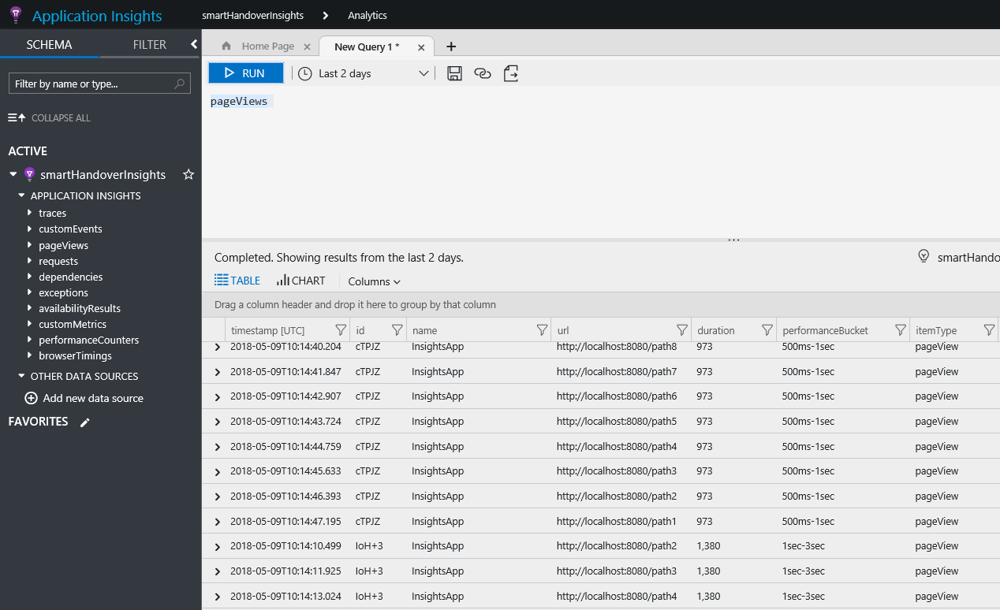

# angular-app insight sample app

#Quick start

###### Clone our repo
$ git clone https://github.com/palanivelus/app-insights-angular-example.git app-insights-angular-example

###### change directory to your app
$ cd app-insights-angular-example

###### install the dependencies with npm
$ npm install

###### start the server
$ npm start

# Code Explanation

###### NPM dependencies 
```json
     "dependencies": {
      "applicationinsights-js": "^1.0.8" 
     }
     "devDependencies":{
      "@types/applicationinsights-js": "^1.0.2"
     }
```
###### Create monitoring service 

	
	export class MyMonitoringService{
	
	private config: Microsoft.ApplicationInsights.IConfig = { 
		instrumentationKey: 'a753d763-e4d0-4a86-a445-124947e45600' //Azure app insight instrumentation key
	}; 

	constructor() { 
		if (!AppInsights.config) { 
			AppInsights.downloadAndSetup(this.config); 
		} 
	} 

	logPageView(name?: string, url?: string, properties?: any, 
			measurements?: any, duration?: number) { 
	AppInsights.trackPageView(name, url, properties, measurements, duration); 
	} 

	logEvent(name: string, properties?: any, measurements?: any) { 
		AppInsights.trackEvent(name, properties, measurements); 
		}
    } 


###### Create base component 


	
	export class BaseComponent { 
	
	private myMonitoringService: MyMonitoringService; 

	constructor() { 
		// Manually retrieve the monitoring service from the injector 
		// so that constructor has no dependencies that must be passed in from child 
		const injector = ReflectiveInjector.resolveAndCreate([ 
			MyMonitoringService 
		]); 
		this.myMonitoringService = injector.get(MyMonitoringService); 
		this.logNavigation(); 
	} 

	private logNavigation() { 
		this.myMonitoringService.logPageView(); 
		}
	} 

###### Extend base component to each component

    export class HomeComponent extends  BaseComponent implements OnInit {
    
      constructor() { 
        super();   // It will trigger whenever instantiate the component 
      }
    }


###### Insight data screen shot from azure 
 

###### Reference 
https://blogs.msdn.microsoft.com/premier_developer/2017/05/11/add-application-insights-to-an-angular-spa/
